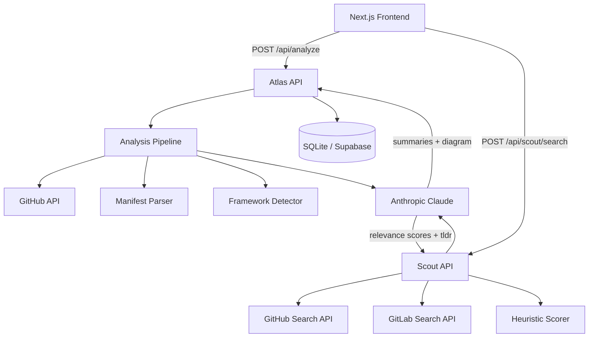

# Codebase Atlas Toolkit

[](https://github.com/MentalVibez/AI_Architecture_Explainer/actions/workflows/backend.yml)
[](https://github.com/MentalVibez/AI_Architecture_Explainer/actions/workflows/frontend.yml)

Two instruments. One workflow.

**RepoScout** discovers and ranks GitHub and GitLab repositories by quality and semantic relevance. **Atlas** reads the winner and explains its architecture — deterministically, without guesswork.

---

## Tools

### 01 / RepoScout — `/scout`

Search GitHub and GitLab simultaneously. For each result, RepoScout computes a **quality score** (stars, recency, license, README, maintenance signals) and a **relevance score** (LLM-assigned semantic fit to your query), blends them into an overall rank, and surfaces a plain-English TLDR.

Noise suppression filters out forks, archived repos, mirrors, and awesome-lists before scoring. The evidence panel exposes every factor that contributed to the score.

### 02 / Atlas — `/`

Paste a GitHub URL. Atlas fetches the repo tree, parses manifests deterministically, detects frameworks with heuristics, then uses Claude to generate a Mermaid architecture diagram and dual summaries — one for developers, one for hiring managers.

The LLM is used only for final summarization. All dependency extraction and framework detection is deterministic and testable.

---

## How Atlas works

1. **Fetch** — GitHub API retrieves the repo tree and priority files (manifests, configs, entry points)
2. **Parse** — deterministic heuristics extract dependencies, detect frameworks, infer folder responsibilities
3. **Evidence** — structured analysis object is built from verifiable file evidence only
4. **Summarize** — Claude generates developer and hiring manager summaries from the evidence, not from raw files
5. **Diagram** — Mermaid flowchart is generated from the structured component graph

## How RepoScout works

1. **Fetch** — GitHub and GitLab search APIs queried in parallel
2. **Filter** — forks, archived repos, templates, and mirrors hard-excluded or penalised
3. **Quality score** — deterministic: stars, recency, license, README, description, fork ratio
4. **Relevance score** — LLM-assigned: semantic fit between repo and user query
5. **Blend** — `overall = 0.4 × quality + 0.6 × relevance`, sorted descending
6. **TLDR** — LLM generates a plain-English summary of the landscape

---

## System architecture



---

## Stack

| Layer | Tech |
|-------|------|
| Frontend | Next.js 14 (App Router), TypeScript, Tailwind CSS, Mermaid |
| Backend | FastAPI, Python 3.11+, SQLAlchemy (async), Alembic |
| LLM | Anthropic `claude-sonnet-4-6` — tool-use for Atlas, text for Scout |
| Database | SQLite (dev) → Supabase Postgres (prod) |
| Testing | pytest — deterministic tests, no real API calls |

---

## Quickstart

### Backend

```bash
cd backend
python -m venv .venv
source .venv/bin/activate        # Windows: .venv\Scripts\activate
pip install -e ".[dev]"
cp .env.example .env             # add ANTHROPIC_API_KEY
alembic upgrade head
uvicorn app.main:app --reload
```

API: `http://localhost:8000` · Docs: `http://localhost:8000/docs`

### Frontend

```bash
cd frontend
npm install
cp .env.local.example .env.local
npm run dev
```

App: `http://localhost:3000`

---

## API

### Atlas

| Method | Path | Description |
|--------|------|-------------|
| `POST` | `/api/analyze` | Submit a repo URL — returns `job_id` |
| `GET` | `/api/analyze/{job_id}` | Poll job status (`queued` → `running` → `completed`) |
| `GET` | `/api/results/{result_id}` | Fetch the completed analysis payload |

### RepoScout

| Method | Path | Description |
|--------|------|-------------|
| `POST` | `/api/scout/search` | Search GitHub/GitLab and return scored, ranked results |

### System

| Method | Path | Description |
|--------|------|-------------|
| `GET` | `/health` | Health check |

---

## Project structure

```
├── backend/
│   ├── app/
│   │   ├── api/              Route handlers (Atlas + Scout routers)
│   │   ├── core/             Config (pydantic-settings) + async DB engine
│   │   ├── llm/              LLMProvider protocol, Anthropic impl, Scout prompts
│   │   ├── models/           SQLAlchemy ORM models (repos, jobs, results)
│   │   ├── schemas/          Pydantic request/response schemas (Atlas + Scout)
│   │   ├── services/         Analysis pipeline, GitHub fetcher, manifest parser,
│   │   │                     framework detector, summary service, repo_scout service
│   │   └── utils/            GitHub URL parser, helpers
│   ├── alembic/              DB migrations
│   ├── scout_benchmark.py    Scoring benchmark harness (NDCG@3, noise gate)
│   ├── baseline.json         Locked benchmark baseline — never overwrite
│   ├── current.json          Latest benchmark run
│   └── tests/                Deterministic unit tests (Atlas + Scout)
├── frontend/
│   ├── app/                  Next.js pages — / (Atlas), /scout (RepoScout)
│   ├── components/           UI — form, diagram panel, summaries
│   └── lib/                  Typed API client + shared types
├── docs/
│   ├── RANKING_PHILOSOPHY.md  Why Scout scores the way it does
│   ├── SCORING_DECISIONS.md   Per-signal rationale and tuning history
│   └── tuning_log.md          Benchmark results over time
└── .github/workflows/         CI for backend (ruff + pytest) and frontend (eslint + build)
```

---

## Scout scoring

| Signal | Weight | Notes |
|--------|--------|-------|
| Stars | up to 22 pts | tiered: 10 / 100 / 1k / 5k |
| Recency | up to 15 pts | penalises repos inactive > 1 year |
| License | 7 pts | known SPDX identifier required |
| README | 7 pts | GitLab only (verified via API); GitHub unverified |
| Forks | up to 5 pts | signals community adoption |
| Description length | 3 pts | penalises empty descriptions |
| Topics | 3 pts | rewards repos with 3+ topics |
| **Quality subtotal** | **max 70** | deterministic, no LLM |
| **Relevance** | **max 100** | LLM-assigned semantic fit |
| **Overall** | `0.4 × Q + 0.6 × R` | relevance-weighted blend |

Noise penalties: forks −15, mirrors −10, no description −5. Hard exclusions: archived repos below 50 stars, forks below 20 stars.

See [docs/RANKING_PHILOSOPHY.md](docs/RANKING_PHILOSOPHY.md) and [docs/SCORING_DECISIONS.md](docs/SCORING_DECISIONS.md) for full rationale.

---

## Benchmark

The benchmark harness validates every weight change against 30 queries across 6 classes (standard, ambiguous, misleading, low-star, noise, anti-awesome).

```bash
cd backend
python scout_benchmark.py                          # run with default weights
python scout_benchmark.py --save current.json      # save results
python scout_benchmark.py --compare baseline.json current.json --gate  # gate check
```

Gate criteria: mean NDCG@3 must not decrease, no critical query regresses >0.15, no new noise gate failures.

---

## Atlas limitations

- **Private repos** are not supported — the GitHub API requires authentication and tokens are not stored
- **Very large repos** (>10k files) may return a partial tree; results will note this
- **Polyglot repos** have best-effort detection; primary language gets the most accurate results
- **Confidence scores** reflect how much verifiable file evidence supports each inference
- **The LLM does not invent files or services** — prompts explicitly instruct it to report only what the evidence supports

---

## Deployment

Deploys to **Railway** (backend) + **Vercel** (frontend) + **Supabase** (Postgres). See [DEPLOY.md](DEPLOY.md) for full step-by-step instructions.

---

## Environment variables

### Backend (`backend/.env`)

| Variable | Required | Description |
|----------|----------|-------------|
| `ANTHROPIC_API_KEY` | Yes | Anthropic API key |
| `GITHUB_TOKEN` | No | Increases GitHub API rate limit from 60 to 5000 req/hr |
| `DATABASE_URL` | No | Defaults to `sqlite+aiosqlite:///./dev.db`; use `postgresql+asyncpg://...` for Supabase |
| `ENVIRONMENT` | No | `development` or `production` |
| `CORS_ORIGINS` | No | Comma-separated allowed origins; defaults to `http://localhost:3000` |

### Frontend (`frontend/.env.local`)

| Variable | Default | Description |
|----------|---------|-------------|
| `NEXT_PUBLIC_API_URL` | `http://localhost:8000` | Backend base URL |
