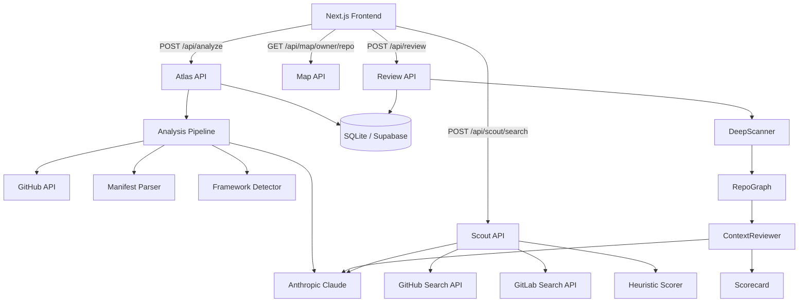

# CodebaseAtlas

[](https://github.com/MentalVibez/AI_Architecture_Explainer/actions/workflows/backend.yml)
[](https://github.com/MentalVibez/AI_Architecture_Explainer/actions/workflows/frontend.yml)
[](https://www.gnu.org/licenses/agpl-3.0)

**Live:** [www.codebaseatlas.com](https://www.codebaseatlas.com)

Four instruments. One workflow.

**RepoScout** discovers and ranks GitHub and GitLab repositories by quality and semantic relevance. **Atlas** reads the winner and explains its architecture — deterministically, without guesswork. **Map** charts the full API surface of any repo. **Review** runs a deep intelligence pass: file-level graph analysis, evidence-backed findings, a six-dimension production scorecard, and human-gated repair suggestions.

---

## Tools

### 01 / RepoScout — `/scout`

Search GitHub and GitLab simultaneously. For each result, RepoScout computes a **quality score** (stars, recency, license, README, maintenance signals) and a **relevance score** (LLM-assigned semantic fit to your query), blends them into an overall rank, and surfaces a plain-English TLDR.

Noise suppression filters out forks, archived repos, mirrors, and awesome-lists before scoring. The evidence panel exposes every factor that contributed to the score.

### 02 / Atlas — `/`

Paste a GitHub URL. Atlas fetches the repo tree, parses manifests deterministically, detects frameworks with heuristics, then uses Claude to generate:

- A **Mermaid architecture diagram**
- A **Technical View** — stack, entry points, architectural patterns, and component responsibilities
- A **Non-Technical View** — plain-English summary: what the project does, skills demonstrated, complexity, and standout points

The LLM is used only for final summarization. All dependency extraction and framework detection is deterministic and testable.

### 03 / Map — `/map`

Paste a GitHub URL. Map detects the framework, selects targeted regex patterns, extracts every route, then uses Claude to group and describe the full API surface.

### 04 / Review — `/review`

Submit a GitHub URL. Review runs a seven-stage intelligence pipeline:

1. **Ingest** — full repo tree via GitHub API
2. **DeepScan** — per-file language detection, role classification, import graph, framework signals, sensitive-op detection
3. **RepoGraph** — BFS dependency graph (depth cap 2, version 2 semantics) — identifies critical path files
4. **ContextReview** — deterministic pattern findings first; conditional LLM review only for critical-path files with risk signals
5. **Explain** — Atlas-style summary and Mermaid diagram from verified evidence
6. **Score** — six-dimension production scorecard with multi-dimensional confidence
7. **Optimize** — human-gated repair proposals (never auto-applied to auth, payment, or migration code)

---

## Pipeline architecture

```
GitHub URL
    │
    ▼
Ingest ──────── GitHub API tree + file contents
    │
    ▼
DeepScan ─────── detect_language / classify_role / build_file_intelligence
    │             (deterministic, no LLM)
    ▼
RepoGraph ─────── build_code_contexts / DependencyEdge BFS
    │             (confirmed / inferred / unresolved edges)
    ▼
ContextReview ─── deterministic patterns first → conditional LLM for high-risk files
    │             (CodeFinding — evidence mandatory)
    ▼
Explain ─────────  Claude generates summaries + Mermaid diagram from evidence object
    │
    ▼
Score ───────────  ProductionScore: 6 dimensions, ConfidenceBreakdown, deductions only
    │             from CodeFindings or missing artifacts
    ▼
Optimize ────────  RepairProposal — human approval always required
                  NEVER_AUTO_PATCH: auth, payment, security, migrations, architectural
```

---

## System architecture



---

## Stack

| Layer | Tech |
|-------|------|
| Frontend | Next.js 14 (App Router), TypeScript, Tailwind CSS, Mermaid |
| Backend | FastAPI, Python 3.11+, SQLAlchemy (async), Alembic |
| LLM | Anthropic `claude-sonnet-4-6` — tool-use for Atlas/Review, text for Scout |
| Database | SQLite (dev) → Supabase Postgres (prod) |
| Hosting | Vercel (frontend) + Railway web/worker services (backend) + Supabase (database) |
| Testing | pytest — deterministic tests, no real API calls |

---

## Quickstart

### Backend

```bash
cd backend
python -m venv .venv
source .venv/bin/activate        # Windows: .venv\Scripts\activate
pip install -e ".[dev]"
cp .env.example .env             # add ANTHROPIC_API_KEY
alembic upgrade head
uvicorn app.main:app --reload

# separate terminal — queue worker
python -m app.worker
```

API: `http://localhost:8000` · Docs: `http://localhost:8000/docs`

### Frontend

```bash
cd frontend
npm install
cp .env.local.example .env.local
npm run dev
```

App: `http://localhost:3000`

---

## API

### Atlas

| Method | Path | Description |
|--------|------|-------------|
| `POST` | `/api/analyze` | Submit a repo URL — returns `job_id` |
| `GET` | `/api/analyze/{job_id}` | Poll job status (`queued` → `running` → `completed`) |
| `GET` | `/api/results/{result_id}` | Fetch the completed analysis payload |

### RepoScout

| Method | Path | Description |
|--------|------|-------------|
| `POST` | `/api/scout/search` | Search GitHub/GitLab and return scored, ranked results |

### Map

| Method | Path | Description |
|--------|------|-------------|
| `GET` | `/api/map/{owner}/{repo}` | Extract and describe the full API surface of a repo |

### Review

| Method | Path | Description |
|--------|------|-------------|
| `POST` | `/api/review/` | Submit a repo for deep review — returns `job_id` (202) |
| `GET` | `/api/review/{job_id}` | Poll review job status |
| `GET` | `/api/review/results/{result_id}` | Fetch scorecard, findings, and scores |

### Intelligence (deep layer — returns after Review completes)

| Method | Path | Description |
|--------|------|-------------|
| `GET` | `/api/results/{result_id}/intelligence` | Full intelligence report |
| `GET` | `/api/results/{result_id}/score` | Production scorecard only |
| `GET` | `/api/results/{result_id}/findings` | Paginated findings (filterable by severity/category) |
| `GET` | `/api/results/{result_id}/graph` | Graph summary (edge counts, confidence, critical path) |
| `GET` | `/api/results/{result_id}/files` | Paginated file listing (filterable by role/language) |
| `GET` | `/api/results/{result_id}/edges` | Paginated dependency edges (filterable by confidence) |

### System

| Method | Path | Description |
|--------|------|-------------|
| `GET` | `/health` | Health check |

---

## Intelligence engine

The Review pipeline produces evidence-first output across four dimensions of confidence:

| Confidence dimension | What it measures |
|---|---|
| `extraction_confidence` | Fraction of files parsed without errors |
| `graph_confidence` | Fraction of internal imports that resolved to confirmed edges |
| `finding_confidence` | Fraction of findings with mandatory line-range + evidence snippet |
| `score_confidence` | Weighted blend of the above, capped at 0.97 ("static analysis is never certain") |

Every output item carries a **truth label** (`confirmed` / `inferred` / `degraded` / `excluded` / `unknown`) indicating how much verifiable evidence supports it.

### Scoring dimensions

| Dimension | Basis |
|---|---|
| Security | Hardcoded secrets, eval/exec, raw SQL format strings, unsafe subprocess calls, pickle/yaml loading |
| Performance | Detected anti-patterns relative to framework signals |
| Reliability | Error handling coverage, exception propagation, test presence |
| Maintainability | Complexity scores, nesting depth, documentation coverage |
| Test coverage | Test file ratio, assertion density |
| Documentation | Docstring coverage, README presence, inline comment density |

Scores start at 100 and deduct points only from `CodeFinding` evidence, missing artifacts, or confidence adjustment. No points are invented.

### Known import resolution limits

See [docs/LIMITATIONS.md](docs/LIMITATIONS.md) for the full table. Key cases:

| ID | Pattern | Status |
|---|---|---|
| L-001 | `from package import module` (non-signal-word package) | Partial (v1.1.0) |
| L-003 | Dynamic imports (`importlib`, `__import__`) | Structurally unresolvable — excluded from confidence denominator |
| L-004 | Non-default TypeScript path aliases | Requires `tsconfig.json` parsing |

Graph semantics are documented in [docs/SEMANTICS.md](docs/SEMANTICS.md). Current: **version 2** (BFS, depth cap 2, shortest-path critical path).

---

## Project structure

```
├── backend/
│   ├── app/
│   │   ├── api/              Route handlers — Atlas, Scout, Map, Review, Intelligence, Public
│   │   ├── core/             Config (pydantic-settings) + async DB engine
│   │   ├── llm/              LLMProvider protocol, Anthropic impl, Scout prompts
│   │   ├── models/           SQLAlchemy ORM — repos, jobs, results, intelligence tables
│   │   ├── schemas/          Pydantic schemas — Atlas, Scout, intelligence contracts
│   │   ├── services/         Analysis pipeline, GitHub fetcher, manifest parser,
│   │   │                     framework detector, summary service, deep_scanner,
│   │   │                     context_reviewer, scorecard, report_builder, pipeline
│   │   └── utils/            GitHub URL parser, helpers
│   ├── alembic/              DB migrations
│   ├── scout_benchmark.py    Scoring benchmark harness (NDCG@3, noise gate)
│   ├── baseline.json         Locked benchmark baseline — never overwrite
│   └── tests/
│       ├── legacy/           Original Atlas + Scout unit tests
│       ├── unit/             Intelligence engine unit tests (deep_scanner, graph, invariants)
│       ├── integration/      End-to-end pipeline tests
│       └── fixtures/         Golden repos + real-world fixture models
├── frontend/
│   ├── app/                  Next.js pages — / (Atlas), /scout, /map, /review
│   ├── components/           UI — form, diagram panel, Technical View, Non-Technical View
│   └── lib/                  Typed API client + shared types
├── docs/
│   ├── PIPELINE_ARCHITECTURE.md  Seven-stage pipeline spec
│   ├── SEMANTICS.md              Frozen behavioral contracts (graph version, confidence rules)
│   ├── LIMITATIONS.md            Import resolution limitation catalog (L-001 – L-007)
│   ├── RANKING_PHILOSOPHY.md     Why Scout scores the way it does
│   ├── SCORING_DECISIONS.md      Per-signal rationale and tuning history
│   └── tuning_log.md             Benchmark results over time
└── .github/workflows/            CI — backend (ruff + pytest) and frontend (eslint + build)
```

---

## Scout scoring

| Signal | Weight | Notes |
|--------|--------|-------|
| Stars | up to 22 pts | tiered: 10 / 100 / 1k / 5k |
| Recency | up to 15 pts | penalises repos inactive > 1 year |
| License | 7 pts | known SPDX identifier required |
| README | 7 pts | GitLab only (verified via API); GitHub unverified |
| Forks | up to 5 pts | signals community adoption |
| Description length | 3 pts | penalises empty descriptions |
| Topics | 3 pts | rewards repos with 3+ topics |
| **Quality subtotal** | **max 70** | deterministic, no LLM |
| **Relevance** | **max 100** | LLM-assigned semantic fit |
| **Overall** | `0.4 × Q + 0.6 × R` | relevance-weighted blend |

Noise penalties: forks −15, mirrors −10, no description −5. Hard exclusions: archived repos below 50 stars, forks below 20 stars.

See [docs/RANKING_PHILOSOPHY.md](docs/RANKING_PHILOSOPHY.md) and [docs/SCORING_DECISIONS.md](docs/SCORING_DECISIONS.md) for full rationale.

---

## Benchmark

The benchmark harness validates every weight change against 30 queries across 6 classes (standard, ambiguous, misleading, low-star, noise, anti-awesome).

```bash
cd backend
python scout_benchmark.py                          # run with default weights
python scout_benchmark.py --save current.json      # save results
python scout_benchmark.py --compare baseline.json current.json --gate  # gate check
```

Gate criteria: mean NDCG@3 must not decrease, no critical query regresses >0.15, no new noise gate failures.

---

## LLM cost model

The intelligence pipeline makes targeted LLM calls — not one per file. The `ContextReviewer` uses a gating rule to decide when Claude is worth invoking:

| Condition | LLM invoked? |
|---|---|
| File is on the critical path (BFS depth ≤ 2 from any entrypoint) | Always |
| File has ≥ 50 LOC **and** has sensitive operations detected | Yes |
| File complexity score ≥ 15 | Yes |
| File is called by ≥ 3 other files (high blast radius) | Yes |
| File role is `test`, `config`, `migration`, or `infra` | Never |

Per-repo LLM calls are bounded by a concurrency semaphore (`max_concurrent=5`) and a hard stage timeout (`REVIEW_TIMEOUT_SECONDS=180`). Deterministic findings always run first — the LLM only adds to them, never replaces them.

### Large repo behavior

The scanner has a hard ceiling of **800 files per repo** (`HARD_MAX_FILES`). Beyond that:

- Files are prioritised by role and criticality — entrypoints, services, and config files are fetched first
- Partial results are returned with a degraded `extraction_confidence` score reflecting actual coverage
- The dependency graph confidence reflects only the scanned files — truth labels in the UI show `"degraded"` rather than hiding the gap
- No errors are raised — partial results are explicit, not silent failures

---

## Limitations

- **Private repos** are not supported — the GitHub API requires authentication and tokens are not stored
- **Very large repos** (>10k files) may return a partial tree; results will note this
- **Polyglot repos** have best-effort detection; primary language gets the most accurate results
- **Confidence scores** reflect how much verifiable file evidence supports each inference
- **The LLM does not invent files or services** — prompts explicitly instruct it to report only what the evidence supports
- **Import graph** is subject to the L-001 – L-007 limitation catalog in [docs/LIMITATIONS.md](docs/LIMITATIONS.md)

---

## Deployment

Deploys to **Railway** (backend) + **Vercel** (frontend) + **Supabase** (Postgres). See [DEPLOY.md](DEPLOY.md) for setup and [docs/PRODUCTION_ROLLOUT.md](docs/PRODUCTION_ROLLOUT.md) for the live rollout checklist and smoke test.

| Service | Platform | Trigger |
|---------|----------|---------|
| Backend web | Railway | Push to `main` |
| Backend worker | Railway | Push to `main` |
| Frontend | Vercel | Push to `main` (Next.js auto-build) |
| Database | Supabase | Manual — `alembic upgrade head` against prod DB URL |

---

## Environment variables

### Backend (`backend/.env`)

| Variable | Required | Description |
|----------|----------|-------------|
| `ANTHROPIC_API_KEY` | Yes | Anthropic API key |
| `GITHUB_TOKEN` | No | Increases GitHub API rate limit from 60 to 5000 req/hr |
| `DATABASE_URL` | No | Defaults to `sqlite+aiosqlite:///./dev.db`; use `postgresql+asyncpg://...` for Supabase |
| `ENVIRONMENT` | No | `development` or `production` |
| `CORS_ORIGINS` | No | Comma-separated allowed origins; defaults to `http://localhost:3000` |
| `WORKER_POLL_INTERVAL_SECONDS` | No | Worker queue poll cadence; default `2.0` |
| `WORKER_STALE_JOB_SECONDS` | No | Marks stuck running jobs as failed after this many seconds; default `1800` |
| `WORKER_QUEUE_ORDER` | No | Queue claim order for worker; default `atlas,review` |
| `OPS_WORKER_QUEUE_ALERT_SECONDS` | No | Queue age threshold for worker backlog alerts; default `120` |

### Frontend (`frontend/.env.local`)

| Variable | Default | Description |
|----------|---------|-------------|
| `NEXT_PUBLIC_API_URL` | `http://localhost:8000` | Backend base URL |
