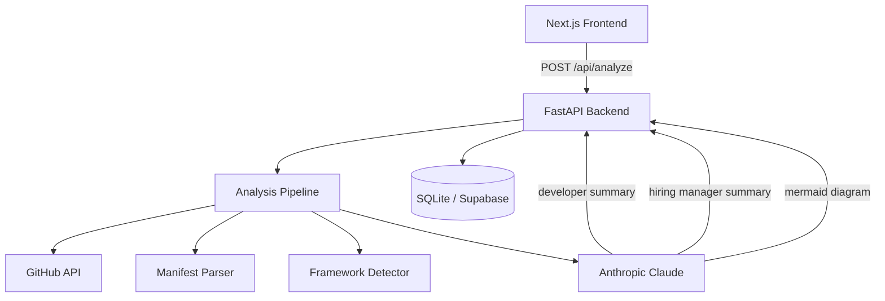

# Codebase Atlas

[](https://github.com/MentalVibez/AI_Architecture_Explainer/actions/workflows/backend.yml)
[](https://github.com/MentalVibez/AI_Architecture_Explainer/actions/workflows/frontend.yml)

AI-powered architecture analysis for public GitHub repositories. Paste a URL, get a Mermaid architecture diagram, a dependency breakdown, and two summaries — one for developers, one for hiring managers.

---

## How it works

1. **Fetch** — GitHub API retrieves the repo tree and priority files (manifests, configs, entry points)
2. **Parse** — deterministic heuristics extract dependencies, detect frameworks, infer folder responsibilities
3. **Evidence** — structured analysis object is built from verifiable file evidence only
4. **Summarize** — Claude generates developer and hiring manager summaries from the evidence, not from raw files
5. **Diagram** — Mermaid flowchart is generated from the structured component graph

The LLM is used only at step 4 and 5. Everything before that is deterministic and testable.

---

## System architecture



---

## Stack

| Layer | Tech |
|-------|------|
| Frontend | Next.js 14 (App Router), TypeScript, Tailwind CSS, Mermaid |
| Backend | FastAPI, Python 3.11+, SQLAlchemy (async), Alembic |
| LLM | Anthropic `claude-sonnet-4-6` via tool-use for structured output |
| Database | SQLite (dev) → Supabase Postgres (prod) |
| Testing | pytest, pytest-asyncio — 32 deterministic tests |

---

## Sample output

Given `https://github.com/fastapi/fastapi`, the analysis engine produces:

```json
{
  "detected_stack": {
    "backend": ["FastAPI"],
    "database": [],
    "infra": ["GitHub Actions"],
    "testing": ["Pytest"]
  },
  "entry_points": ["fastapi/__init__.py", "fastapi/applications.py"],
  "confidence_score": 0.85
}
```

**Developer summary (excerpt):**
> This is the FastAPI framework source repository itself. It exposes a single installable Python package with the framework core in `fastapi/`, comprehensive test coverage in `tests/`, and documentation in `docs/`. Entry points are the `FastAPI` application class and the `APIRouter` abstraction...

**Hiring manager summary (excerpt):**
> FastAPI is a modern Python web framework for building APIs. This repository is the framework's own source code, not an application built with it. It demonstrates advanced Python type-system usage, OpenAPI schema generation, and a rigorous test suite...

---

## Quickstart

### Backend

```bash
cd backend
python -m venv .venv
source .venv/bin/activate        # Windows: .venv\Scripts\activate
pip install -e ".[dev]"
cp .env.example .env             # add ANTHROPIC_API_KEY
alembic upgrade head
uvicorn app.main:app --reload
```

API: `http://localhost:8000` · Docs: `http://localhost:8000/docs`

### Frontend

```bash
cd frontend
npm install
cp .env.local.example .env.local
npm run dev
```

App: `http://localhost:3000`

---

## API

| Method | Path | Description |
|--------|------|-------------|
| `POST` | `/api/analyze` | Submit a repo URL — returns `job_id` |
| `GET` | `/api/analyze/{job_id}` | Poll job status (`queued` → `running` → `completed`) |
| `GET` | `/api/results/{result_id}` | Fetch the completed analysis payload |
| `GET` | `/health` | Health check |

---

## Project structure

```
├── backend/
│   ├── app/
│   │   ├── api/              Route handlers
│   │   ├── core/             Config (pydantic-settings) + async DB engine
│   │   ├── llm/              LLMProvider protocol + Anthropic implementation
│   │   ├── models/           SQLAlchemy ORM models (repos, jobs, results)
│   │   ├── schemas/          Pydantic request/response schemas
│   │   ├── services/         Analysis pipeline, GitHub fetcher, manifest parser,
│   │   │                     framework detector, summary service
│   │   └── utils/            GitHub URL parser, helpers
│   ├── alembic/              DB migrations
│   └── tests/                32 deterministic unit tests
├── frontend/
│   ├── app/                  Next.js pages (App Router)
│   ├── components/           UI — form, diagram panel, dev/HM summaries
│   └── lib/                  Typed API client + shared types
└── .github/workflows/        CI for backend (ruff + pytest) and frontend (eslint + build)
```

---

## Limitations and confidence

The analysis engine is honest about uncertainty:

- **Private repos** are not supported — the GitHub API requires authentication and we do not store tokens
- **Very large repos** (>10k files) may return a partial tree; results will note this
- **Polyglot repos** (e.g. Go + Python + Rust) have best-effort detection; primary language gets more accurate results
- **Confidence scores** reflect how much verifiable file evidence supports each inference — low scores mean the LLM is making educated guesses, and the result will say so
- **The LLM does not invent files or services** — prompts explicitly instruct it to report only what the evidence supports

---

## Deployment

Deploys to **Railway** (backend) + **Vercel** (frontend) + **Supabase** (Postgres). See [DEPLOY.md](DEPLOY.md) for full step-by-step instructions.

---

## Environment variables

### Backend (`backend/.env`)

| Variable | Required | Description |
|----------|----------|-------------|
| `ANTHROPIC_API_KEY` | Yes | Anthropic API key |
| `GITHUB_TOKEN` | No | Increases GitHub API rate limit from 60 to 5000 req/hr |
| `DATABASE_URL` | No | Defaults to `sqlite+aiosqlite:///./dev.db`; use `postgresql+asyncpg://...` for Supabase |
| `ENVIRONMENT` | No | `development` or `production` |
| `CORS_ORIGINS` | No | Comma-separated allowed origins; defaults to `http://localhost:3000` |

### Frontend (`frontend/.env.local`)

| Variable | Default | Description |
|----------|---------|-------------|
| `NEXT_PUBLIC_API_URL` | `http://localhost:8000` | Backend base URL (browser) |
| `API_URL` | falls back to `NEXT_PUBLIC_API_URL` | Backend base URL (server components only) |
